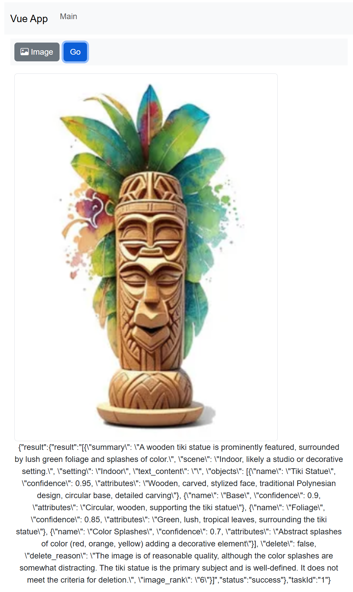

# Agent Management System

This repository contains a multi-service application built using Docker Compose. It includes three main components:

- **Backend**: A Flask API service that provides a REST API and communicates with the AI Agents service. See [`backend/app.py`](c:\src\agent-container-sandbox\agent-management-system\backend\app.py).
- **AI Agents**: A Flask API service that handles task execution. See [`ai_agents/app.py`](c:\src\agent-container-sandbox\agent-management-system\ai_agents\app.py) and [`ai_agents/agent_manager.py`](c:\src\agent-container-sandbox\agent-management-system\ai_agents\agent_manager.py).
- **Frontend**: A Vue 3 application built with Vite that interacts with the backend API. See [`frontend/src/App.vue`](c:\src\agent-container-sandbox\agent-management-system\frontend\src\App.vue) and [`frontend/src/config/backend_conf.ts`](c:\src\agent-container-sandbox\agent-management-system\frontend\src\config\backend_conf.ts).



## Project Structure

```
agent-management-system/
├── docker-compose.yml
├── backend/
│   ├── app.py
│   ├── Dockerfile
│   └── requirements.txt
├── ai_agents/
│   ├── app.py
│   ├── agent_manager.py
│   ├── Dockerfile
│   └── requirements.txt
└── frontend/
    ├── Dockerfile
    ├── index.html
    ├── package.json
    ├── vite.config.js
    └── src/
        ├── App.vue
        ├── main.ts
        ├── components/
        │   └── Main.vue
        ├── config/
        │   └── backend_conf.ts
        └── router/
            └── index.ts
```

## Getting Started

### Prerequisites

- [Docker](https://www.docker.com/get-started) and Docker Compose must be installed on your system.
- If you use an external LLM provider like Groq, you must create a key file in the project root folder and paste your API key. See [docker-compose.yml](./docker-compose.yml). (Local OLLAMA models require no API key)

### Running the Application

### Build and Start Containers

From the project root, run:

```sh
docker-compose up
```

## Tips

### Build single container

For a faster dev cycle, you can build and run a single container and let the others run in the background.

From the project root, spin up all containers in detached mode:

```sh
docker-compose up --build -d
```

Then rebuild and run single container as needed:

```sh
docker-compose up --build ai_agents
```
